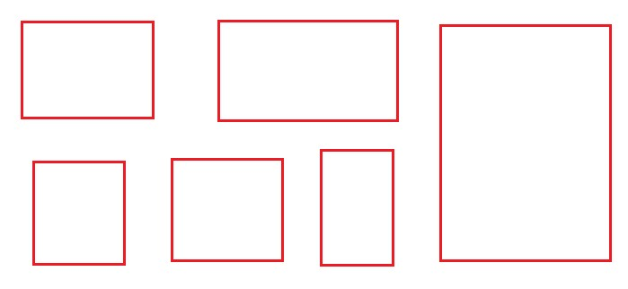

# MiroDesk || Mirror Desk
前端（React）： 使用 React 来构建用户界面，包括文件上传界面、文件管理界面等。你可以利用 React 组件来处理用户的交互操作，并将上传的文件信息发送到后端进行处理。

后端（Node.js）： 使用 Node.js 来搭建后端服务。可以使用 Express.js 框架来处理 HTTP 请求、路由管理等。在后端处理文件上传请求，并将文件保存到服务器或云存储服务中。

文件存储： 要保存用户上传的文件，你可以选择将文件存储在服务器本地，或者使用云存储服务，如 Amazon S3、Google Cloud Storage、或者阿里云 OSS 等。

数据库： 使用数据库来存储文件的元数据信息，比如文件名、文件大小、上传时间、访问码等。可以选择使用 MongoDB、MySQL 等数据库来存储这些信息。

文件下载授权： 实现一个授权系统，生成唯一的访问码或链接，用于文件下载。用户在输入正确的访问码后能够获取到对应的文件。

安全性： 考虑文件上传的安全性，确保对上传的文件进行有效的验证和过滤，防止恶意文件的上传。同时也要保护用户的隐私和文件安全。

部署： 将前端和后端部署到服务器上，并确保它们能够协同工作。

feature:
- 多电脑工作台(mirrorDesktop)
	- 文件传递
	- 剪贴板
	- markdown文本编辑器
	- 充分利用显示空间
		- goal: 作为自己的web的桌面替代传统的mac or windows桌面
			- 设计哲学:尽可能聚焦于一个page, 如果切换到其他page就是切换工作模式的时候
				- 如何解决屏幕大小不同的问题?
					- 设计两种layout模式
						- 固定布局
							- 完全自定义布局方式, 固定后可以绑定具体的电脑和视口大小,视口大小不符合的时候会自动变成flex布局并弹出提示
								- 提示类似windows的多屏幕切换的时候, 提示是否保留当前布局,5,4,3,2,1
						- flex布局
							- 自动布局,且留有一定空隙
					- 
		- 类似figma 
		- 类似snipaste截图的操作便利度来定义自己的布局和工作台, 顶部有类似ppt制作的工具条
		- 支持添加特殊的工作区模块
			- 可能是iframe植入的第三方网站
			- 可能是基于此平台的插件/小程序
		- 滚轮下拉的时候就是显示控制台的主功能的时候
			- 也就是文件传递,剪贴板,....的功能
		- 第一版用Node开发基础功能, 后续转go
	- pin图片
	- 快速截图
	- 取色

# 技术选型
先用纯react状态管理，帮助更深理解react  ||  jotai 
dayjs
styled-component
拖拽： dnd-kit https://github.com/clauderic/dnd-kit
动画： react spring/web

# stage
## stage 1 实现即可, 不考虑优雅动画, 但需要记录自己后续需要优化的点
json配置提供一个可选的版本,选定后会载入localstorage, 
## stage 2

## todo
- 优化工具区弹出动画
- 集成自训练的gpt
